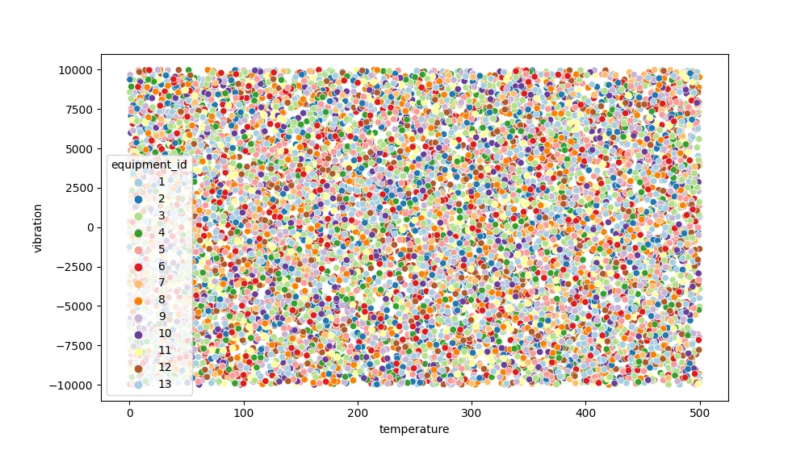

# Hard skill test | Data Engineer

## Description and Objectives
This assignment provides data concerning sensors and equipments on a FPSO vessel. The objective is to develop a roadmap to process the data in order to answer the following questions:

1. Total equipment failures that happened?
2. Which equipment code had most failures?
3. Average amount of failures across equipment group, ordered by the number of failures in ascending order?

## Data exploration

A first glance at the data was made using a bash terminal.
Three files were provided:

1. `equipment_failure_sensors.log` - Contains data from every sensor of an equipment during the event of a failure.

```
$ head equipment_failure_sensors.log
[2019-12-10 10:46:09]	ERROR	sensor[5]:	(temperature	365.26, vibration	-6305.32)
[2019-12-10 10:46:09]	ERROR	sensor[43]:	(temperature	458.47, vibration	-58.41)
[2019-12-10 10:46:09]	ERROR	sensor[44]:	(temperature	57.16, vibration-999.66)
[2019-12-10 10:46:09]	ERROR	sensor[67]:	(temperature	106.69, vibration	-4659.02)
[2019-12-02 06:53:29]	ERROR	sensor[5]:	(temperature	26.42, vibration-3438.67)
[2019-12-02 06:53:29]	ERROR	sensor[43]:	(temperature	353.76, vibration	5363.72)
[2019-12-02 06:53:29]	ERROR	sensor[44]:	(temperature	15.63, vibration-5354.56)
[2019-12-02 06:53:29]	ERROR	sensor[67]:	(temperature	499.88, vibration	9300.94)
[2020-03-04 23:01:04]	ERROR	sensor[11]:	(temperature	448.08, vibration	-5107.17)
[2020-03-04 23:01:04]	ERROR	sensor[15]:	(temperature	301.09, vibration	4205.29)

```

2. `equipment_sensors.csv` - Provides mapping between equipments and sensors.
```
equipment_id;sensor_id
4;1
8;2
13;3
11;4
1;5
5;6
8;7
7;8
13;9
```

3. `equipment.json` - Provides equipment data.
```
$ cat equipment.json | jq '.' | head -n 16
[
  {
    "equipment_id": 1,
    "code": "5310B9D7",
    "group_name": "FGHQWR2Q"
  },
  {
    "equipment_id": 2,
    "code": "43B81579",
    "group_name": "VAPQY59S"
  },
  {
    "equipment_id": 3,
    "code": "E1AD07D4",
    "group_name": "FGHQWR2Q"
  },
```

While `equipment_sensors.csv` and `equipment.json` are already structured, `equipment_failure_sensors.log` requires some cleaning and structuring, as performed in the solution.

## Solution strategy
Given the data and the objective, the solution will require the following steps:

1. Process `equipment_failure_sensors.log` in order to structure the data.
2. Subset failures belonging to the desired time interval (Jan/2020).
3. Join failure and equipment data using the relationship in `equipment_sensors.csv`.
4. Group data by *date* and *equipment* in order to isolate each event. (At this point, it should be possible to answer questions 1 and 2)
5. Group data by equipment group. (Information should be enough to answer question 3)

In order to choose a framework for a task, I usually make a brief evaluation regarding:
- Data size and structure,
- Objectives (Data comprehension or an answer to an isolated question),
- co-workers' preferred framework, and
- Urgency

among other factors.

In the context of this assignment, I have provided a solution using **Spark**, as it has been described as a desired skill for the position. **Spark** would also have been my framework of choice if these same questions were to be answered from big data - or in a project where scale is a concern. However, for an isolate task - like this assignment - with a small amount of data and aimed at answering just a few questions, I would have also considered writing a simpler script using **Pandas**.

## Solution Script - Pyspark

This script was written observing the strategy described above. It is commented to describe each step and provides the answers for the questions when executed, as shown below.

```python
from pyspark.sql import SparkSession
from pyspark.sql.functions import split, regexp_replace
from pyspark.sql.types import TimestampType, StringType, FloatType

spark = SparkSession.builder \
                    .master("local[1]") \
                    .appName("ShapeTest") \
                    .getOrCreate()

# read data
match = spark.read.option("header", "true") \
                  .option("delimiter", ";") \
                  .csv("equipment_sensors.csv")
equip = spark.read.option("multiline", "true") \
                  .json("equipment.json")
fail = spark.read.text("equipment_failure_sensors.log")

# remove descriptive texts from failure data and clear deleted fields
fail = fail.withColumn('value', regexp_replace(
    'value', "[A-Za-z\[\]\(\),]:*", "")) \
    .withColumn('value', regexp_replace(
        'value', "\t+", "\t"))

# enforce schema to failure data
fail_schema = {
    'datetime': [0, TimestampType()],
    'sensor_id': [1, StringType()],
    'temperature': [2, FloatType()],
    'vibration': [3, FloatType()]
}
for k, v in fail_schema.items():
    fail = fail.withColumn(k, split('value', "\t").getItem(v[0]).cast(v[1]))
fail = fail.drop('value')

# select desired period
start = "2020-01-01 00:00:00"
end = "2020-01-31 23:59:59"
fail_jan = fail.filter("datetime between '%s' and '%s'" % (start, end))

# join data
df = fail_jan.join(match, on=['sensor_id'], how='left') \
             .join(equip, on=['equipment_id'], how='left')


# 1) Total equipment failures that happened?
total_fails = df.groupby("datetime", "code").count()
ans_1 = total_fails.count()

# 2) Which equipment code had most failures?
code_fails = total_fails.groupby(['code']).count().orderBy('count')
ans_2 = code_fails.tail(1)

# 3) Average amount of failures across equipment group, ordered by the number of failures in ascending order?
group_fails = code_fails.join(equip, on=['code'], how='left')
ans_3 = group_fails.groupby('group_name').avg('count').orderBy('avg(count)')

print('1) Total equipment failures that happened?')
print(ans_1)
print('2) Which equipment code had most failures?')
print(ans_2[0]['code'])
print('3) Average amount of failures across equipment group, ordered by the number of failures in ascending order?')
ans_3.show()
```
## Answers
Executing the code outputs the desired answers:
```
$ python3 spark_script.py
1) Total equipment failures that happened?
1579
2) Which equipment code had most failures?
E1AD07D4
3) Average amount of failures across equipment group, ordered by the number of failures in ascending order?
+----------+----------+
|group_name|avg(count)|
+----------+----------+
|  9N127Z5P|     108.0|
|  NQWPA8D3|     116.5|
|  VAPQY59S|     120.0|
|  PA92NCXZ|     122.5|
|  FGHQWR2Q|     129.0|
|  Z9K1SAP4|     129.0|
+----------+----------+
```
## Further data exploration

A plot of temperature vs vibration was generated in order to look for insights, but it was verified that this data is probably random with temperature *t* with 0 < *t* < 500, and vibration *v* with -10000 < *v* <10000.


